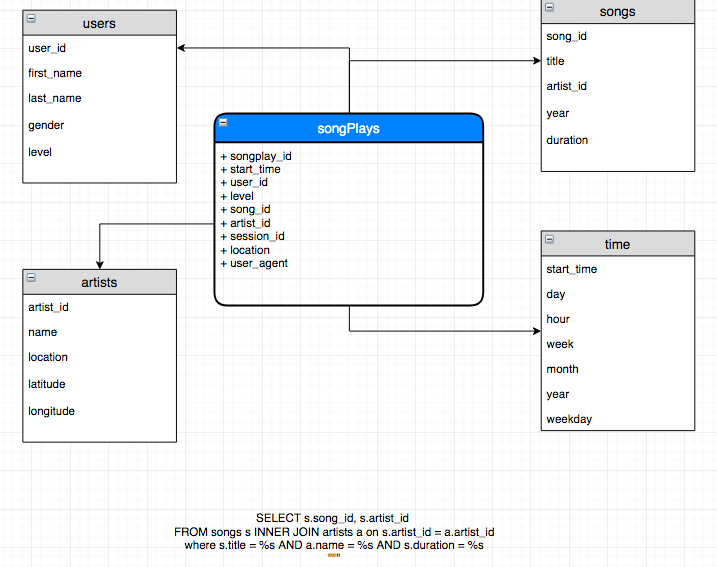

### Data Modeling - Project 1
### William Galindez Arias

#### Challenge

Very often small or big companies count with TBs of raw data, such data is stored with the intent to be used later in order to find any 'insights' which should be provided by Analytics team.
In this scenario, the dataset is made of thousands of records that contain songs and user activity from a streaming application. Problem is, the sources of data are in JSON format, the one which 
is light and human readable but not friendly to be used by their analytics team and derive insights from it. 

#### Solution

Given the fact that Sparkify  main requirement is to analyze historical  data, it is possible to infer they require Business Intelligence Capabilities, for this purpose a good approach is to leverage Object Relational Database System using a Star Schema optimized for queries in historical records to support decision making with a set of tables meaningful for the Analytics team.

#### Steps towards the Solution 

A traditional ETL process is executed, the one where

1. Extract the data from a given location in JSON format
2. Transform the data to a Dataframe structure, where is easier to select and filter data by columns, clean it, observe it, transform it, as done in the Time stamp step and read it
3. Load, use the transformed data to load into into the Postgres database 

Additional steps were followed in the Notebook, where data validation was carried out by using simple assertions to ensure the number of records was consistent during transformations

#### Star Schema

As mentioned before, star schema was chosen to leverage DWH like queries, to acomplish this

1. Started by creating the dimension tables, each of them with its respective Primary Key and conditions, these tables describe the fact table
2. Fact Table containing the transactional data such us start time of the 'clicked' song 

#### Tools

A combination of SQL, Libraries such as Pandas, Postgres database and Jupyter lab were leveraged to create a solution that performs ETL and serves a Star Schema, where BI teams can play 
and run different queries such as the one in the test.ipynb which can answer business questions like "How many songs does the app have played?"

`SELECT t.month, t.year, COUNT(sp.songplay_id) as songplay_counter FROM songplays sp LEFT JOIN time t on sp.start_time = t.start_time GROUP BY t.month, t.year;`

#### Links
https://www.w3schools.com/sql/sql_and_or.asp
http://kva.es/Beginning%20Database%20Design.pdf
